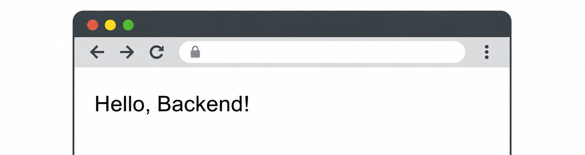
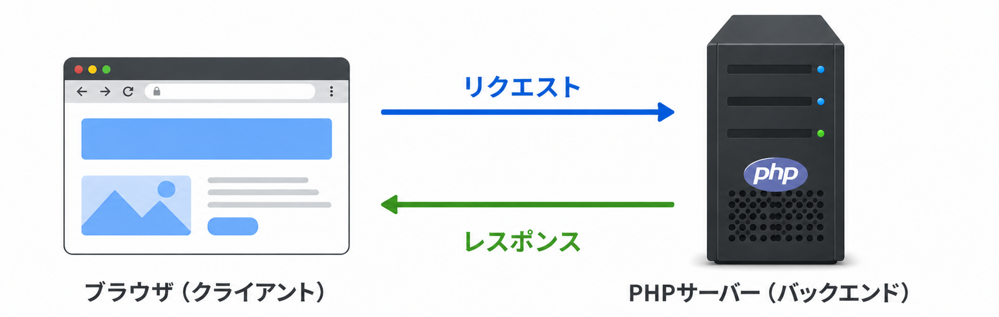

<!-- _class: title -->
<!-- _footer: "" -->
<!-- _paginate: skip -->

# AI 時代のためのバックエンド開発入門

## セクション 3: PHPで最小のバックエンドを作る

<!-- ## このセクションのゴール

### セクション2で学んだこと

HTTP・リクエスト/レスポンス・JSON・API という概念

### このセクションでやること

それらの概念を **PHPのコードとして動かす** 体験をします。

「URLにアクセスするとJSONが返ってくるAPI」を自分で作ります。 -->

---

<!-- _class: heading -->
<!-- _footer: "" -->

# 開発環境を整える

---

## 開発環境の全体像

このセクションで使うものは3つだけです。

| ツール | 役割 |
|--------|------|
| VSCode | コードを書くエディタ |
| PHP | バックエンドを動かすプログラミング言語 |
| PHP内蔵サーバー | ローカルでHTTPサーバーを動かす仕組み |

PHPには開発用の内蔵サーバーが用意されており、コマンド1行で起動できます。この講座では、環境構築のハードルを下げるためにこれを使います。

<div class="tip">

> これ以降の動画で、VSCodeのインストールと拡張機能の追加、PHPをインストールするためのパッケージ管理ツールとPHPのインストールを解説します。

</div>

---

<!-- _footer: "<div>VSCode のインストール(macOS)</div>" -->

## VSCode のインストール（macOS）

### VSCode（Visual Studio Code）とは

- Microsoft が提供する無料のコードエディタ
- 軽量・高速な動作で、Windows / Mac / Linuxに対応
- 「拡張機能」により、自分好みの開発環境へ自由にカスタマイズ可能
- 世界中のエンジニアが最も愛用している標準的なツール

### インストール

公式サイトからインストーラをダウンロードして実行します。

> インストーラは[公式サイト（https://code.visualstudio.com/）](https://code.visualstudio.com/)からダウンロードできます。

---

<!-- _footer: "<div>VSCode のインストール(Windows)</div>" -->

## VSCode のインストール（Windows）

### VSCode（Visual Studio Code）とは

- Microsoft が提供する無料のコードエディタ
- 軽量・高速な動作で、Windows / Mac / Linuxに対応
- 「拡張機能」により、自分好みの開発環境へ自由にカスタマイズ可能
- 世界中のエンジニアが最も愛用している標準的なツール

### インストール

公式サイトからインストーラをダウンロードして実行します。

> インストーラは[公式サイト（https://code.visualstudio.com/）](https://code.visualstudio.com/)からダウンロードできます。

---

<!-- _footer: "<div>VSCode の日本語化</div>" -->

## VSCode の日本語化

### 日本語言語パックのインストール

拡張機能の「Japanese Language Pack for VS Code」をインストールします。

### UI言語を日本語に変更

インストール後に右下に表示される「Change Language and Restart」をクリックします。
これで、VSCode の日本語化は完了です。

<div class="tip">

> 日本語言語パックのインストール後に、コマンドパレットからも言語切り替えが可能です。
`Ctrl+Shift+P` もしくは、`Cmd+Shift+P` でコマンドパレットを表示して、「configure display language」と入力します。ここで、「日本語」を選択することで、日本語への切り替えが可能です。

</div>

---

<!-- _footer: "<div>PHP Intelephense（VSCode 拡張機能）のインストール</div>" -->

## PHP Intelephense（VSCode 拡張機能）のインストール

### PHP Intelephense とは

- VSCode で PHP 開発を効率化する高性能な言語サーバー拡張機能
- コードの自動補完 / エラー検出を行い、コーディングにおける強力なサポートを提供

### インストール

VSCode の拡張機能で「PHP Intelephense」を検索してインストール

> VSCode に組み込まれている PHP 言語機能を無効化する必要があります。

---

<!-- _footer: "<div>Homebrew のインストール（macOS）</div>" -->

## Homebrew のインストール（macOS）

### Homebrew とは

- macOS / Linux 対応のパッケージ管理ツール
- ツールの導入・更新・削除をターミナルにコマンドを打ち込むだけで完結

### インストール

ターミナルで以下のコマンドを実行します。

```bash
/bin/bash -c "$(curl -fsSL https://raw.githubusercontent.com/Homebrew/install/HEAD/install.sh)"
```

> インストールコマンドは[公式サイト（https://brew.sh/ja/）](https://brew.sh/ja/)から確認できます。

---

<!-- _footer: "<div>PHP のインストール（macOS）</div>" -->

## PHP のインストール（macOS）

Homebrew を使ってインストールします。

```bash
brew install php
```

### インストールの確認

```bash
php -v
```

`PHP 8.x.x (cli)` と表示されれば成功です。

> エラーになる場合は、ターミナルを一度閉じて開き直してください。

---

<!-- _footer: "<div>Scoop のインストール（Windows）</div>" -->

## Scoop のインストール（Windows）

### Scoop とは

Windows で利用できるパッケージ管理ツールです。macOS の Homebrew のように、PowerShell にコマンドを入力して、さまざまなツールをインストール・管理できます。

### インストール

PowerShell（バージョン5.1以降）を開き、`PS C:\>` プロンプトから以下を実行します。

```bash
Set-ExecutionPolicy -ExecutionPolicy RemoteSigned -Scope CurrentUser
Invoke-RestMethod -Uri https://get.scoop.sh | Invoke-Expression
```

> インストールコマンドは[公式サイト（https://scoop.sh/）](https://scoop.sh/)から確認できます。

---

<!-- _footer: "<div>PHP のインストール（Windows）</div>" -->

## PHP のインストール（Windows）

Scoop を使ってインストールします。

```bash
scoop install php
```

### インストールの確認

```bash
php -v
```

`PHP 8.x.x (cli)` と表示されれば成功です。

> エラーになる場合は、ターミナルを一度閉じて開き直してください。

---

<!-- _class: heading -->
<!-- _footer: "" -->

# バックエンドを動かす

---

## プロジェクト構成を作る

```text
project/
├── api/
│   └── index.php
└── public/
```

| フォルダ / ファイル | 役割 |
|-----------------|------|
| `api/` | バックエンドのPHPファイルを置く場所 |
| `api/index.php` | 最初に作るAPIファイル |
| `public/` | フロントエンドのファイルを置く場所 |

`api/` と `public/` を分けるのは、**役割を明確に分離するため**です。

---

## 最初のPHPコードを書く

`api/index.php` に以下のコードを書きます。

```php
<?php
echo "Hello, Backend!";
```

| 部分 | 意味 |
|------|------|
| `<?php` | ここからPHPのコードが始まるという宣言 |
| `echo` | 文字列を出力する命令 |

まだAPIではありません。PHPが動くことを確認するための第一歩です。

---

## PHP内蔵サーバーを起動する

`project/` フォルダでターミナルを開き、以下を実行します。

```bash
php -S localhost:8000
```

| 部分 | 意味 |
|------|------|
| `php -S` | PHP内蔵サーバーを起動するオプション |
| `localhost` | 自分のコンピューター上で動かす |
| `8000` | 使用するポート番号 |

---

## ブラウザで確認する

ブラウザで以下のURLにアクセスします。

```text
http://localhost:8000/api/index.php
```

`Hello, Backend!` と表示されれば成功です。

<div class="text-center">



</div>

---

## 「リクエスト / レスポンス」が動いている瞬間

ブラウザで確認したとき、何が起きていたのか？

<div class="text-center">



</div>

<!-- ```text
ブラウザ（クライアント） ───[リクエスト]──▶︎ PHPサーバー（バックエンド）
ブラウザ（クライアント） ◀︎──[レスポンス]─── PHPサーバー（バックエンド）
``` -->

セクション2で学んだ「リクエスト / レスポンス」が、  実際に動いている瞬間です。

---

<!-- _class: heading -->
<!-- _footer: "" -->

# JSONを返すAPIにする

---

## コードを変更する

`api/index.php` の内容を以下に書き換えます。

```php
<?php
header("Content-Type: application/json");

echo json_encode([
  "message" => "Hello, API!"
]);
```

| 部分 | 意味 |
|------|------|
| `header(...)` | レスポンスの形式がJSONであることを伝える |
| `json_encode(...)` | PHPの配列をJSON文字列に変換する |

ブラウザで同じURLにアクセスすると `{"message":"Hello, API!"}` が返ってきます。

---

## curlでAPIを確認する

### curlとは

`curl` は、ターミナルからHTTPリクエストを送るコマンドです。
<!-- ブラウザを使わずにAPIの動作を確認できます。 -->
<!-- Windowsでは、使用しているPowerShellのバージョンによってコマンドが変わるので注意 -->

### macOS / Linux / PowerShell 7.x

```bash
curl http://localhost:8000/api/index.php
```

### Windows PowerShell 5.1

`curl` コマンドに `.exe` を付けます。

```bash
curl.exe http://localhost:8000/api/index.php
```

<!-- PowerShell 5.1 では、`curl` は `Invoke-WebRequest` という PowerShell コマンドの 「エイリアス（別名）」 です。そのため、Linux の `curl` と同じ感覚でオプション（-d や -H など）を使うとエラーになります。 -->

---

## curlの実行結果

ターミナルに以下のようなレスポンスが表示されます。

```json
{"message":"Hello, API!"}
```

**ここが「API」です。**  HTMLではなくJSONを返すようになりました。  セクション2で学んだ「なぜHTMLではなくJSONなのか」が、ここで実感できます。

> ブラウザとcurlの両方でAPIを確認できることで、「APIはURLにアクセスすれば使えるもの」という理解が深まります。

---

<!-- _class: heading -->
<!-- _footer: "" -->

# 簡単なエンドポイントを作る

---

## URLで処理を分ける（ルーティング）

<!-- URLごとに異なる処理を返します。 -->
`api/index.php` の `header(...)` 以降の内容を書き換えます。

```php
$path = $_SERVER["REQUEST_URI"];

if ($path === "/api/hello") {
  echo json_encode(["message" => "Hello"]);
} else {
  http_response_code(404);
  echo json_encode(["error" => "Not Found"]);
}
```

| 部分 | 意味 |
|------|------|
| `$_SERVER["REQUEST_URI"]` | アクセスされたURLのパス部分を取得する |
| `http_response_code(404)` | HTTPステータスコードを指定する |

---

## 動作を確認する

以下のURLにアクセスして、それぞれ異なるレスポンスが返ることを確認します。

```JSON
http://localhost:8000/api/hello
─▶︎ {"message":"Hello"}

http://localhost:8000/api/other
─▶︎ {"error":"Not Found"}
```

> セクション2で「URLで機能を分ける」と説明した内容が、コードとして動いています。

###### URLごとに処理を分けることが、APIの基本的な設計

---

## セクション3のまとめ

| 項目 | 内容 |
|------|------|
| 環境構築 | VSCode・PHPのインストールと確認 |
| サーバー起動 | `php -S` で内蔵サーバーを動かす |
| JSON返却 | `header()` と `json_encode()` でAPIを作る |
| ルーティング | URLによって処理を分岐させる |

今のコードは、アクセスのたびに同じ結果を返すだけです。「連絡先を登録する」操作をしたとしても、データはどこにも保存されません。

次のセクションでは、この問題を解決するために**データベース**が必要な理由を考えます。
