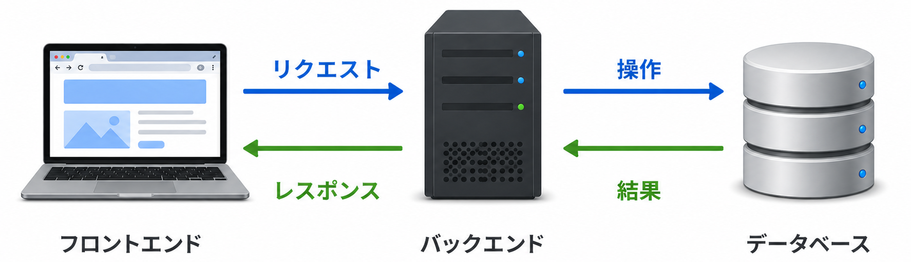

<!-- _class: title -->
<!-- _footer: "" -->
<!-- _paginate: skip -->

# AI 時代のためのバックエンド開発入門

## セクション 4: データの永続化

---

<!-- _class: heading -->
<!-- _footer: "" -->

# データが保存されない問題

---

## 3つの保存方法を比べる

このセクションでは、3つの保存方法を比べながら「なぜDBが必要なのか」を理解します。

| 方法 | 特徴 |
|------|------|
| PHPの変数 | リクエスト中だけ使える一時的な置き場所 |
| LocalStorage | ブラウザ内に残せる個人用の保存場所 |
| データベース | Webアプリの正式な保存場所 |

---

## 固定データは「保存」ではない

`api/index.php` を次のように変更します。

```php
<?php
header("Content-Type: application/json");

$contacts = [
  ["id" => 1, "name" => "田中 太郎", "email" => "taro@example.com"]
];

echo json_encode($contacts, JSON_UNESCAPED_UNICODE);
```

- `$contacts` に直接書いたデータは、毎回作られているだけ
- リロードしても残っているように見えるが、保存されているわけではない

---

## 変数に追加すれば保存できるのか？

`api/index.php` を次のように変更します。

```php
<?php
header("Content-Type: application/json");

$contacts = [];

if ($_SERVER["REQUEST_METHOD"] === "POST") {
  $input = json_decode(file_get_contents("php://input"), true);
  $contacts[] = ["id" => 1, "name" => $input["name"], "email" => $input["email"]];
}

echo json_encode($contacts, JSON_UNESCAPED_UNICODE);
```

POSTした直後のレスポンスだけを見ると、登録できたように見えます。  
でも次のリクエストでは `$contacts` が空に戻ります。

---

## POSTする

<!-- _class: tight -->

#### macOS / Linux

```
curl -X POST http://localhost:8000/api/index.php \
  -H "Content-Type: application/json" \
  -d '{"name":"田中 太郎","email":"taro@example.com"}'
```

#### PowerShell 7.x

<!-- PowerShell で複数行のコマンドを入力するには、改行の前にバッククォート（`）を使う必要があります。 -->

```
curl -X POST http://localhost:8000/api/index.php `
  -H "Content-Type: application/json" `
  -d '{"name":"田中 太郎","email":"taro@example.com"}'
```

#### Windows PowerShell 5.x

<!-- PowerShell 5 から外部プログラム `curl.exe` にダブルクォートを含む文字列を渡す際、`"""` （三重引用符）で囲むと正しくエスケープされます。 -->

```
curl.exe -X POST http://localhost:8000/api/index.php `
-H "Content-Type: application/json" `
-d '{"""name""":"""田中 太郎""","""email""":"""taro@example.com"""}'
```

結果：`[{"id":1,"name":"田中 太郎","email":"taro@example.com"}]`

<!-- 一見、登録できたように見えます。 -->

---

## GETする

### macOS / Linux / PowerShell 7.x

```
curl http://localhost:8000/api/index.php
```

### Windows PowerShell 5.1

```
curl.exe http://localhost:8000/api/index.php
```

結果：`[]`

**さきほどPOSTした連絡先は残っていません。**

---

## なぜデータが消えるのか

PHPの変数はメモリ上に存在します。  
メモリはプログラムが動いている間だけデータを保持し、プログラムが終了すると消えます。

```text
リクエストが来る
  → index.php が最初から実行される
  → 変数が作られる
  → レスポンスを返す
  → そのリクエスト中の変数は破棄される
```

<!-- _class: important -->

> **「このままではアプリとして使えない」**  
> データが消えてしまうなら、どれだけ良いUIを作っても意味がありません。

---

<!-- _class: heading -->
<!-- _footer: "" -->

# LocalStorageで解決できるのでは？

---

## LocalStorageとは

LocalStorageは、ブラウザ上にデータを保存できる仕組みです。

```javascript
const contacts = [
  { name: "田中 太郎", email: "taro@example.com" }
];

// データを保存する
localStorage.setItem("contacts", JSON.stringify(contacts));

// データを取り出す
const saved = JSON.parse(localStorage.getItem("contacts"));
```

リロードしてもデータが残るため、「これで解決できるのでは？」と思うかもしれません。  
しかし、Webアプリとして使おうとすると、すぐに限界が見えてきます。

---

## LocalStorageの限界

### 問題1：ブラウザ・端末をまたいで共有できない

- 自分のPCのChromeに保存したデータは、スマホから見られない
- 他のユーザーと同じデータを共有できない

<!-- > **「LocalStorageは"自分専用メモ帳"」** -->

### 問題2：セキュリティが弱い

- ブラウザの開発者ツールから確認・変更できる  
- 個人情報や認証情報の管理には向いていない

### 問題3：機能が弱い

- 検索・並び替え・複数条件の絞り込みなど、アプリに必要な操作が苦手

---

<!-- _class: heading -->
<!-- _footer: "" -->

# データベースとは何か

---

<!-- _class: tight -->

## サーバー側にデータを保存する

LocalStorageの限界を踏まえると、必要なものが見えてきます。

- **サーバー側**にデータを保存する
- 誰がアクセスしても、同じデータを参照できる
- 検索・並び替えなどの操作ができる

これを実現するのが **データベース（DB）** です。

<div class=text-center>



</div>

<!-- ```text
フロントエンド ──[リクエスト]─▶ バックエンド ──[操作]─▶ データベース
フロントエンド ◀─[レスポンス]── バックエンド ◀─[結果]── データベース
``` -->

<!-- セクション1・2で繰り返し登場した図です。   -->
**フロントエンドはDBに直接アクセスせず、必ずバックエンドを経由します。**

---

## 3つの保存方法を比べる

| 観点 | 変数 | LocalStorage | データベース |
|------|-----------|--------------|--------------|
| 保存場所 | リクエスト中のメモリ | ブラウザ | サーバー側 |
| リロード後 | 残らない | 残る | 残る |
| データの共有 | できない | できない | できる |
| 検索・集計 | 不向き | 不向き | 得意 |
| 主な用途 | 一時的な処理 | 個人用の簡易保存 | アプリの正式な保存先 |

<!-- LocalStorageはブラウザ上の一時記憶として有用だが、アプリのデータ管理には適していません -->

---

<!-- _class: heading -->
<!-- _footer: "" -->

# この講座で扱うDB（SQLite）

---

## SQLiteとは

SQLiteとは、軽量かつ高機能なオープンソースのRDBMS（リレーショナルデータベース管理システム）です。

SQLiteの最大の特徴は、**1つのファイルがデータベースそのもの**という点です。

```text
contacts.db ← このファイルがデータベース
```

多くのデータベース（MySQLやPostgreSQLなど）は、別途サーバープロセスを起動する必要がありますが、SQLiteはファイルを作るだけで使い始められます。

---

## なぜSQLiteを選ぶのか

| 理由 | 説明 |
|------|------|
| PHPから扱いやすい | 多くのPHP環境でSQLiteを利用できる |
| 追加サーバー不要 | MySQLのようなDBサーバーを別途起動しなくてよい |
| ファイル1つ | `contacts.db` というファイルがDBのすべて |
| 学習に最適 | 本番環境のDBと同じSQL構文が使える |

SQLiteは大規模な本番環境には向いていませんが、MySQLなど他のDBへ移行するときも、SQLの知識はそのまま活かせます。

---

## セクション4のまとめ

| ポイント | 内容 |
|---------|------|
| データが消える理由 | PHPの変数はリクエストごとにリセットされる |
| LocalStorageの限界 | 共有・セキュリティ・機能の面で本格利用には不向き |
| データベースの役割 | サーバー側にデータを永続的に保存する |
| SQLiteの特徴 | ファイル1つで動く、学習に最適なDB |

次のセクションでは、SQLiteを実際に操作して、データの保存・取得・更新・削除（CRUD）を体験します。
