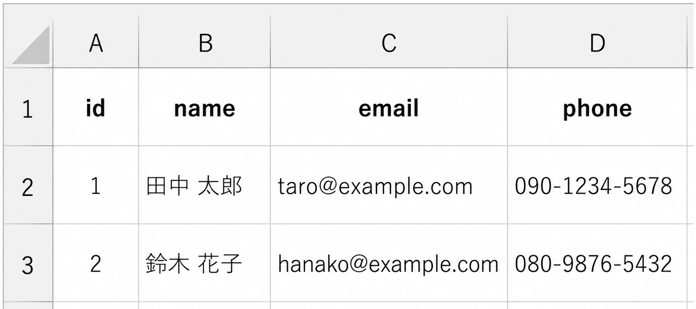
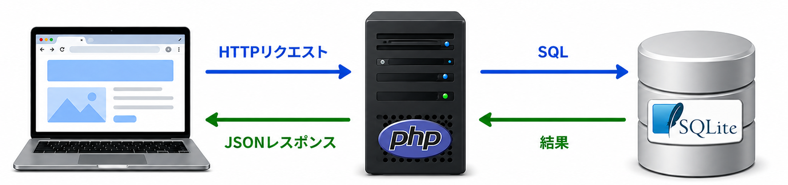

<!-- _class: title -->
<!-- _footer: "" -->
<!-- _paginate: skip -->

# AI 時代のためのバックエンド開発入門

## セクション 5: SQLite入門

---

<!-- _class: heading -->
<!-- _footer: "" -->

# SQLiteの準備

---

## sqlite3のインストール

SQLiteは `sqlite3` というコマンドで操作します。
<!-- ターミナルからSQLを直接入力してデータベースを操作できます。 -->
macOSにはあらかじめインストールされています。Windowsの場合はScoopでインストールできます。

### Windows（Scoop）

```
scoop install sqlite
```

インストール後、バージョンを確認します。

```bash
sqlite3 --version
```

---

## DBファイルを作成して接続する

`project/` フォルダで以下を実行します。

<!-- > 必ず `api/` や `public/` が入っている `project/` フォルダで実行します。  
> 別の場所で実行すると、`contacts.db` が別フォルダに作られてしまいます。 -->

```
sqlite3 contacts.db
```

`contacts.db` というファイルが作られ、SQLiteのプロンプトに入ります。

```text
SQLite version 3.x.x
Enter ".help" for usage hints.
sqlite>
```

`sqlite>` が表示されれば成功です。ここからSQLコマンドを入力できます。

> sqlite3を終了するには `.quit` または `Ctrl + D` を入力します。

---

<!-- _class: heading -->
<!-- _footer: "" -->

# テーブルを理解する

---

## テーブルはExcelの表に似ている

<div class="text-center">



</div>

<!-- ```text
id | name     | email              | phone
---|----------|--------------------|-------------
 1 | 田中 太郎 | taro@example.com   | 090-1234-5678
 2 | 鈴木 花子 | hanako@example.com | 080-9876-5432
``` -->

| 用語 | Excelで言うと | 意味 |
|------|-------------|------|
| テーブル | シート | データをまとめる単位 |
| カラム（列） | 列ヘッダー | データの種類（name, emailなど） |
| レコード（行） | 1行のデータ | 1件の連絡先 |
| 主キー（id） | 行番号 | レコードを一意に識別するID |

<!-- 同じ名前の連絡先が2件あっても、`id` が違えば別のレコードとして管理できます。 -->

---

## テーブルを作る（CREATE TABLE）

`sqlite>` プロンプトで以下を実行します。

```sql
CREATE TABLE contacts (
  id    INTEGER PRIMARY KEY AUTOINCREMENT,
  name  TEXT NOT NULL,
  email TEXT,
  phone TEXT
);
```

| カラム | 型 | 制約 | 意味 |
|--------|---|------|------|
| `id` | INTEGER | PRIMARY KEY AUTOINCREMENT | 自動で連番が振られる主キー |
| `name` | TEXT | NOT NULL | 文字列・必須 |
| `email` | TEXT | — | 文字列・任意 |
| `phone` | TEXT | — | 文字列・任意 |

<!-- SQLでは、`CREATE`や`TABLE`といったSQLの予約語は、慣例として「大文字」で入力し、テーブル名やカラム名のようなデータは小文字で入力します。理由は単純で、「SQLの命令」と「データ」をパッと見て区別しやすくするためです。 -->

<!-- すでに作成済みの状態でもう一度実行すると、`table contacts already exists` と表示されます。これは「すでに contacts テーブルがある」という意味なので、作成自体は成功しています。 -->

---

## テーブルの確認

### テーブルの一覧表示

```text
sqlite> .tables
contacts
```

`contacts` と表示されれば成功です。

### テーブルの定義を確認

```text
sqlite> .schema contacts
CREATE TABLE contacts (
id INTEGER PRIMARY KEY AUTOINCREMENT,
name TEXT NOT NULL,
email TEXT,
phone TEXT
);
```

---

<!-- _class: heading -->
<!-- _footer: "" -->

# データの追加・取得・更新・削除（CRUD）

---

## データを追加する（INSERT）

> ここから先のSQLは、すべて `sqlite>` プロンプトの中で実行します。

```sql
INSERT INTO contacts (name, email, phone)
VALUES ('田中 太郎', 'taro@example.com', '090-1234-5678');

INSERT INTO contacts (name, email, phone)
VALUES ('鈴木 花子', 'hanako@example.com', '080-9876-5432');
```

追加したデータを確認します。

```sql
SELECT * FROM contacts;
1|田中 太郎|taro@example.com|090-1234-5678
2|鈴木 花子|hanako@example.com|080-9876-5432
```

---

## 表示を見やすくする

SQLiteでは、以下のコマンドを実行すると表形式になります。

```sql
sqlite> .headers on   -- SELECT文の検索結果にカラム名を表示
sqlite> .mode column  -- 表示を見やすく整形
```

```sql
SELECT * FROM contacts;
id  name       email               phone
--  ---------  ------------------  -------------
1   田中 太郎   taro@example.com    090-1234-5678
2   鈴木 花子   hanako@example.com  080-9876-5432
```

> `.quit` で終了して `sqlite3 contacts.db` で再接続しても、データは残ったままです。これがデータの**永続化**です。

---

## データを取得する（SELECT）

```sql
-- 全件取得
SELECT * FROM contacts;

-- 特定のカラムだけ取得する
SELECT name, email FROM contacts;

-- 条件を指定して取得する
SELECT * FROM contacts WHERE id = 1;

-- 並び替える
SELECT * FROM contacts ORDER BY email;
```

<!-- LocalStorageでは苦手だった「検索」「並び替え」が、SQLでは数行で実現できます。 -->

> `*` は「すべてのカラム」を意味します。
> `--` は「単一行コメント」を意味し、以降に書かれた文字はメモ書きとして扱われます。

---

## データを更新する（UPDATE）

`id = 1` のレコードの名前を変更します。

```sql
UPDATE contacts SET name = '田中 次郎' WHERE id = 1;
SELECT * FROM contacts WHERE id = 1;
1|田中 次郎|taro@example.com|090-1234-5678
```

<div class="important">

> `WHERE` を書き忘れると、テーブル内の**すべてのレコード**が更新されます。  
> 更新・削除のSQL文では、`WHERE` による絞り込みを必ず確認する習慣をつけましょう。

</div>

---

## データを削除する（DELETE）

`id = 1` のレコードを削除します。

```sql
DELETE FROM contacts WHERE id = 1;
SELECT * FROM contacts;
2|鈴木 花子|hanako@example.com|080-9876-5432
```

`id = 1` のレコードが消え、`id = 2` のレコードだけが残っています。

> `DELETE FROM contacts;` のように `WHERE` を書かないと、**全件削除**になります。

---

<!-- _class: heading -->
<!-- _footer: "" -->

# SQLを整理する

---

## CRUDの4操作

| SQL文 | 操作 | 意味 |
|-------|------|------|
| INSERT | 追加（**C**reate） | テーブルに1件データを追加する |
| SELECT | 取得（**R**ead） | テーブルからデータを読み出す |
| UPDATE | 更新（**U**pdate） | 既存のデータを書き換える |
| DELETE | 削除（**D**elete） | データを削除する |

この4つを合わせて **CRUD**（Create / Read / Update / Delete）と呼びます。  
データベースを扱う操作の大部分は、このCRUDに集約されます。

---

## SQLとLocalStorageを比べる

| 操作 | LocalStorage | SQL |
|------|-------------|-----|
| 保存 | `setItem()` | `INSERT INTO ...` |
| 取得 | `getItem()` | `SELECT * FROM ...` |
| 検索 | 自前で実装が必要 | `WHERE name = '...'` |
| 並び替え | 自前で実装が必要 | `ORDER BY name` |
| 削除 | `removeItem()` | `DELETE FROM ... WHERE id = ...` |

SQLは、データを扱うための専用言語です。  
検索・並び替え・集計など、LocalStorageでは難しかった操作をシンプルな文で記述できます。

---

## なぜバックエンドと組み合わせるのか

ここまではターミナルで直接SQLiteを操作しました。  
しかし、この方法ではフロントエンドからデータを操作できません。

<div class="text-center">



</div>

<!-- ```text
フロントエンド ──[HTTPリクエスト]─▶︎ バックエンド(PHP) ──[SQL]─▶︎ SQLite
フロントエンド ◀︎─[JSONレスポンス]── バックエンド(PHP) ◀︎─[結果]── SQLite
``` -->

- フロントエンド（JavaScript）からSQLiteのファイルに直接アクセスする手段はない
- PHPがSQLiteに接続し、リクエストに応じてSQLを実行する
- 結果をJSONに変換してフロントエンドに返すのも、PHPの役割

---

## セクション5のまとめ

| 項目 | 内容 |
|------|------|
| テーブル | Excelの表のようなデータ構造 |
| CRUD | INSERT / SELECT / UPDATE / DELETE の4操作 |
| SQLの強み | 検索・並び替えをシンプルな文で記述できる |
| 次のステップ | PHPからSQLiteを操作してAPIを作る |

次のセクションでは、PHPからSQLiteに接続し、CRUDの各操作をAPIとして実装します。
