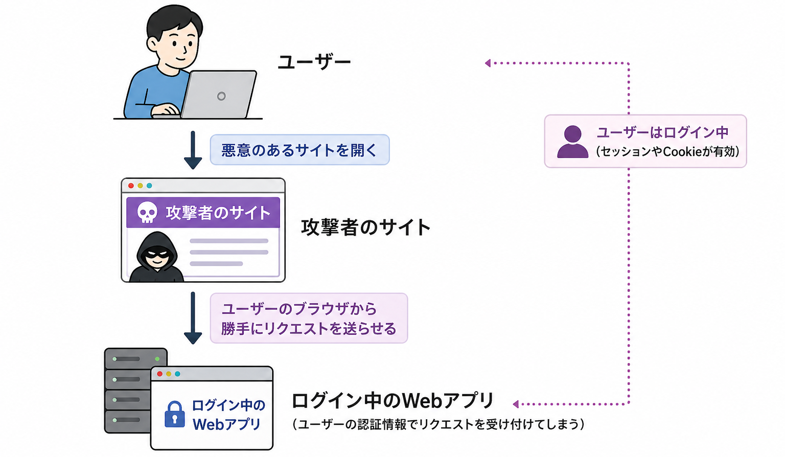

<!-- _class: title -->
<!-- _footer: "" -->
<!-- _paginate: skip -->

# AI 時代のためのバックエンド開発入門

## セクション 9: 知らないと危険なWebセキュリティ入門

---

<!-- _class: heading -->
<!-- _footer: "" -->

# セキュリティの基礎知識

---

## 今のアプリに実際に残っている問題

### 認証・認可がない問題

現在のアドレス帳アプリには、ログイン機能がありません。
APIのURLを知っていれば、**誰でもデータを追加・更新・削除できます**。

| 用語 | 意味 |
|------|------|
| 認証 | 誰がアクセスしているかを確認すること |
| 認可 | その人がその操作をしてよいか確認すること |

<div class="important">

> 「APIが動く」だけでは不十分です。「誰がそのAPIを使ってよいのか」まで考える必要があります。

</div>

---

## このセクションで扱う攻撃手法

ここからは、代表的な3つの攻撃手法を見ていきます。

| 攻撃 | 仕組み | 対策 |
|------|--------|------|
| SQLインジェクション | 入力値をSQLの命令として実行させる | プリペアドステートメント |
| XSS | 入力値をスクリプトとして実行させる | `textContent` / `htmlspecialchars` |
| CSRF | ログイン中のユーザーに意図しないリクエストを送らせる | CSRFトークン |

SQLインジェクションとXSSは**安全な書き方と危険な書き方を比較しながら**確認します。  
CSRFは今回のアプリにログイン機能がないため、概念として扱います。

---

<!-- _class: heading -->
<!-- _footer: "" -->

# SQLインジェクション

---

## SQLインジェクションとは

SQLインジェクションは、攻撃者が入力欄などに特殊な文字列を入れ、**開発者が意図していないSQLを実行させる攻撃**です。入力値をSQL文に直接つなげてしまうと、攻撃者の入力がSQLの命令として解釈されることがあります。

その結果、次のような問題が起きます。

- 本来見えてはいけないデータが取得される
- ログインをすり抜けられる
- データを改ざん・削除される

<div class="important">

> つまりSQLインジェクションは、**入力値がデータではなくSQLの命令として扱われてしまう問題**です。

</div>

---

## 現在のコードでは防げている

セクション6で作ったAPIでは、SQLを実行するときにプリペアドステートメントを使っています。

```php
$stmt = $pdo->prepare("SELECT * FROM contacts WHERE id = ?");
$stmt->execute([$id]);
```

この書き方では、入力から来た値をSQLに直接連結しません。  
そのため、基本的なSQLインジェクションを防ぎやすくなっています。

では、もし危険な書き方をしていたら何が起きるのでしょうか。

---

## 危険なコードを一時的に追加する

`api/index.php` のルーティング分岐の先頭に、以下の**危険な検索エンドポイント**を一時的に追加します。

```php
// 危険なコード（実習用・このまま使わないこと）
if ($method === "GET" && isset($_GET["name"])) {
  $name = $_GET["name"];
  $stmt = $pdo->query(
    "SELECT * FROM contacts WHERE name = '" . $name . "'"
  );
  $contacts = $stmt->fetchAll(PDO::FETCH_ASSOC);
  echo json_encode($contacts, JSON_UNESCAPED_UNICODE);
  exit;
}
```

`$name` をSQL文字列に**直接連結**しています。ここが危険です。

---

<!-- _class: tight -->

## 通常の検索を確認する

```bash
# macOS / Linux / PowerShell 7.x
curl -G "http://localhost:8000/api/contacts" --data-urlencode "name=鈴木 花子"

# Windows PowerShell 5.1
curl.exe -G "http://localhost:8000/api/contacts" --data-urlencode "name=鈴木 花子"

# 実行結果
[{"id":2,"name":"鈴木 花子","email":"hanako@example.com","phone":"080-9876-5432"}]
```

通常の検索は正常に動きます。次に、攻撃用の文字列を送ってみます。

---

<!-- _class: tight -->

## 攻撃用の文字列を送る

```bash
# macOS / Linux / PowerShell 7.x
curl -G "http://localhost:8000/api/contacts" --data-urlencode "name=' OR '1'='1"

# Windows PowerShell 5.1
curl.exe -G "http://localhost:8000/api/contacts" --data-urlencode "name=' OR '1'='1"
```

このとき、PHPが組み立てるSQLは次のようになります。

```sql
SELECT * FROM contacts WHERE name = '' OR '1'='1'
```

`'1'='1'` は常に真です。`WHERE` による絞り込みが無効になり、**テーブル内の全レコードが返ってきます**。

<!-- > **この1行で、データは全部抜かれます。** -->

---

## なぜ起きるのか

SQLインジェクションは、**ユーザーの入力をそのままSQLに埋め込んでしまう**ことで発生します。

```php
// 危険な書き方
$sql = "SELECT * FROM contacts WHERE name = '" . $name . "'";
```

入力値によって、**SQL文の構造そのものが変わってしまう**のが問題です。

確認したら、追加した危険なコードは削除してください。

---

## 対策：プリペアドステートメント

```php
// 安全な書き方
$stmt = $pdo->prepare("SELECT * FROM contacts WHERE name = ?");
$stmt->execute([$name]);
```

`?` はプレースホルダーです。  
PDOは `?` に値をセットするとき、値を**SQLの一部としてではなくデータとして扱います**。

そのため、`$name` に `' OR '1'='1` が入っても、SQLの構造は変わりません。

セクション6で実装したコードは、最初からプリペアドステートメントを使っています。  
<!-- このセクションで、「なぜ `?` を使うのか」を確認しました。 -->

---

<!-- _class: heading -->
<!-- _footer: "" -->

# XSS<br>（クロスサイトスクリプティング）

---

## XSSとは

XSSは、**悪意のあるスクリプトをWebページに埋め込む攻撃**です。

ユーザーが入力した内容を画面に表示するとき、入力値をHTMLとして解釈してしまうと危険です。攻撃者がJavaScriptを含む文字列を登録し、その文字列が他のユーザーのブラウザで実行される可能性があります。

その結果、次のような問題が起きます。

- 偽の画面やメッセージを表示される
- Cookieや画面上の情報を盗まれる
- ユーザーの操作を勝手に実行される

---

## 現在のコードは安全な書き方をしている

現在の `app.js` では、連絡先の表示に `textContent` を使っています。

```javascript
li.textContent = `${name} | ${email ?? "-"} | ${phone ?? "-"}`;
```

`textContent` は値をHTMLとして解釈しません。次のような名前が登録されていても、HTMLタグとして実行されず、ただの文字として表示されます。

```html

```

これは安全な挙動です。

---

## 危険な書き方：innerHTML

もし表示処理を `innerHTML` に変えると、ユーザーの入力がHTMLとして解釈されます。

```javascript
// 危険な書き方
li.innerHTML = `${name} | ${email ?? "-"} | ${phone ?? "-"}`;
```

名前に `` が登録されていた場合、ブラウザはこの文字列を `img` タグとして解釈します。

`src=x` の画像読み込みに失敗すると、`onerror` に書かれたJavaScriptが実行されます。

<div class="important">

> つまりXSSは、**保存されたデータや入力値が、画面表示のタイミングでスクリプトとして実行されてしまう問題**です。

</div>

---

## 対策：HTMLとして解釈させない

JavaScriptで画面に表示するときは、ユーザー入力をHTMLとして扱わないことが重要です。

```javascript
// 安全な書き方
li.textContent = `${name} | ${email ?? "-"} | ${phone ?? "-"}`;
```

PHPからHTMLを直接出力する場合は、`htmlspecialchars()` を使います。

```php
echo htmlspecialchars($name, ENT_QUOTES, 'UTF-8');
```

| 変換前 | 変換後 |
|--------|--------|
| `<` | `&lt;` |
| `>` | `&gt;` |
| `"` | `&quot;` |

---

<!-- _class: heading -->
<!-- _footer: "" -->

# CSRF<br>（クロスサイトリクエストフォージェリ）

---

## CSRFの仕組み

CSRFは、**ログイン中のユーザーに、意図しないリクエストを送らせる攻撃**です。

<div class="flex items-center">



<!-- ```text
ユーザー
  ↓ 悪意のあるサイトを開く
攻撃者のサイト
  ↓ ユーザーのブラウザから勝手にリクエストを送らせる
ログイン中のWebアプリ
``` -->

<div>

ログインにCookieを使っている場合、ブラウザはリクエストにCookieを自動的に添付します。  
サーバー側は「本人が意図して送ったリクエストかどうか」を判別できません。

</div>
</div>

今回のアドレス帳アプリにはログイン機能がないため、実演ではなく概念として扱います。

---

## 対策：CSRFトークン

代表的な対策は **CSRFトークン** です。

1. サーバーがページを返すときに、ランダムな文字列（トークン）を埋め込む
2. フォーム送信時にそのトークンを一緒に送る
3. サーバー側でトークンが一致するかを確認する

攻撃者のサイトからは正しいトークンを取得できないため、リクエストを偽造しにくくなります。

<div class="important">

> ログイン機能やCookieを使った認証を追加するときに、必ず考えるべき対策として覚えておきましょう。

</div>

---

<!-- _class: heading -->
<!-- _footer: "" -->

# AI時代のセキュリティ

---

## AIが生成したコードは安全か

AIはコードを生成できます。しかし、**AIが生成したコードが安全とは限りません**。

実際、AIが生成するコードには、SQLインジェクションやXSSといった脆弱性が含まれることがあります。

セキュリティの基礎知識があれば、AIの出力を見て「このコードは危険だ」と気づける判断力が身につきます。

<div class="important">

> 「動くコードを生成できる」ことと「安全なコードを生成できる」ことは別の話です。

</div>

---

## AI時代のチェックポイント

AIが生成したコードを見るときは、次の点を確認する習慣をつけましょう。

- SQLを組み立てるときに、文字列連結を使っていないか
- ユーザーの入力を `innerHTML` などでHTMLとして埋め込んでいないか
- 認証なしで追加・更新・削除できるAPIになっていないか
- フロントエンドだけで入力チェックを済ませていないか
- エラー時に内部情報をそのまま表示していないか

<div class="important">

> AIはコードを生成できますが、生成されたコードが安全かどうかを判断するのは人間です。  
> セキュリティの知識は、AIを使う時代ほど重要になります。

</div>

---

## セキュリティの考え方をまとめる

| 原則 | 内容 | 関連する問題 |
|------|------|------------|
| 入力値を信じない | ユーザーからの入力は常に不正な値が入る可能性がある | SQLインジェクション・バリデーション不足 |
| 出力時にHTMLとして<br>解釈させない | データを表示するとき、HTMLとして実行されないようにする | XSS |
| 誰が何をできるかを決める | データ変更APIは、認証・認可を前提に設計する | 認証・認可不足 |
| 設計段階から考える | セキュリティを後付けにしない | CSRF・認証不備 |

---

## セクション9のまとめ

| 項目 | ポイント | 対策 |
|------|---------|------|
| 認証・認可不足 | 今のAPIは誰でも追加・更新・削除できる | ログイン・権限チェック |
| SQLインジェクション | 文字列連結でSQLを作ると危険 | プリペアドステートメント |
| XSS | `innerHTML` で入力値をHTMLとして表示すると危険 | `textContent` / `htmlspecialchars` |
| CSRF | ログイン後の操作では偽リクエストに注意が必要 | CSRFトークン |

次のセクションでは、AIを使ってコードを生成するときの考え方と、AIとの役割分担について学びます。
