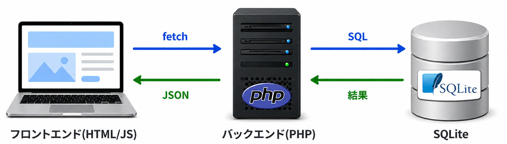

<!-- _class: title -->
<!-- _footer: "" -->
<!-- _paginate: skip -->

# AI 時代のためのバックエンド開発入門

## セクション 11: まとめと次のステップ

---

<!-- _class: heading -->
<!-- _footer: "" -->

# コース全体の振り返り

---

<!-- _class: tight -->

## 何を作り、何を学んだか

| セクション | 学んだこと |
|-----------|-----------|
| 1 | AIで開発する限界とバックエンドを学ぶ動機 |
| 2 | HTTP・リクエスト/レスポンス・JSON・APIの概念 |
| 3 | PHP環境の構築・最小のAPIの作り方 |
| 4 | データ永続化の問題・データベースが必要な理由 |
| 5 | SQLiteの基本操作・CRUD |
| 6 | PHPからSQLiteに接続するAPIの実装 |
| 7 | フロントエンドとバックエンドの連携 |
| 8 | 責務分離・バリデーション・リファクタリング |
| 9 | SQLインジェクション・XSS・CSRFの仕組みと対策 |
| 10 | AIとどう向き合うか・役割分担・プロンプトの書き方 |

---

## 最終的なアプリの構成

<div class="text-center">



</div>

```text
project/
├── api/
│   ├── index.php     ← CRUD APIの実装
│   └── db.php        ← DB接続の切り出し
├── public/
│   ├── index.html    ← フロントエンドの画面
│   └── app.js        ← フロントエンドの処理
└── contacts.db       ← SQLiteのデータベースファイル
```

<!-- フロントエンド（HTML/JS）→ バックエンド（PHP）→ データベース（SQLite）という3層の流れを、一通り自分で実装しました。 -->

---

<!-- _class: heading -->
<!-- _footer: "" -->

# 今のアプリの限界

---

## SQLiteの特徴と限界

| 用途 | SQLite | MySQL / PostgreSQL |
|------|--------|--------------------|
| 学習・プロトタイプ | 向いている | セットアップが手間になることもある |
| 個人ツール・小規模アプリ | 向いている | 過剰になることもある |
| 読み取り中心の小規模本番アプリ | 要件次第 | 使える |
| 書き込み頻度高・高トラフィック | 向きにくい | 向いている |
| 複数サーバー構成 | 向きにくい | 向いている |

<div class="important">

> 「SQLiteだから本番では使えない」という意味ではありません。アプリの規模、同時書き込みの多さ、運用要件に合わせてDBを選ぶことが重要です。

</div>

---

## PHPの直書きの限界

今回は `api/index.php` に処理を書きました。  
セクション8でDB接続を `db.php` に切り出しましたが、それでも以下のような限界があります。

- ルーティングを自前で書いている（`preg_match` での分岐）
- 認証・認可の仕組みがない
- コードが増えると管理が難しくなる

<div class="tip">

> 実際のサービスでは、これらをLaravelのようなフレームワークが解決してくれます。

</div>

---

<!-- _class: heading -->
<!-- _footer: "" -->

# 次のステップ

---

## MySQLへの移行

SQLiteからMySQLに移行するとき、PDOを使っていればPHP側の基本的な書き方は大きく変わりません。

```php
// SQLite
$pdo = new PDO('sqlite:../contacts.db');

// MySQL
$pdo = new PDO('mysql:host=localhost;dbname=myapp;charset=utf8', 'user', 'password');

```

`prepare()` や `execute()` のような基本的な使い方は共通です。

これが、セクション6でPDOを使った理由のひとつです。

---

## Laravelとは何か

**Laravel** は、PHPの代表的なWebフレームワークです。  
今回自分で書いた処理の多くを、Laravelは仕組みとして提供しています。

| 今回自分で書いたこと | Laravelが提供するもの |
|--------------------|--------------------|
| `preg_match` でルーティング | `routes/web.php` でルート定義 |
| `json_decode(...)` で入力取得 | `$request->input(...)` |
| `empty($name)` でバリデーション | `$request->validate([...])` |
| CSRFトークンの実装 | ミドルウェアで自動対応 |
| PDOで直接SQL | Eloquent（ORM）でモデル経由 |

<div class="important">

<!-- フレームワークを使っても、セキュリティの知識は必要です。セクション9で学んだ知識は、Laravel上でも同じように役立ちます。 -->

</div>

---

## 学習のロードマップ

```text
【このコースで学んだこと】
  HTTP・PHP・SQLite・REST API・セキュリティの基礎
         ↓
【次のステップ（バックエンド）】
  MySQL / PostgreSQL → Laravel → 認証・認可 → テスト

【次のステップ（フロントエンド）】
  TypeScript → より安全で保守しやすいJavaScript
         ↓
【その先】
  クラウド（AWS / GCP）→ Docker → CI/CD
```

一度に全部を学ぶ必要はありません。  
今作ったアプリを少しずつ改善していくことが、最も効果的な学習です。

---

<!-- _class: heading -->
<!-- _footer: "" -->

# AIとの向き合い方、改めて

---

## 今できるようになったこと

このコースを通じて、次のことができるようになりました。

- AIが生成したPHPのAPIを読んで、意図を理解できる
- プリペアドステートメントを使っているか確認できる
- `innerHTML` を使っていないか確認できる
- エラーメッセージから問題の場所を推測できる
- AIに具体的な条件を伝えて、より良いコードを引き出せる

---

## これから意識すること

AIは便利なツールです。しかし、生成されたコードを使うのは人間であり、動かす責任も人間にあります。

バックエンドの基礎を理解している人は、AIの出力を「評価」できます。  
これは、AIを道具として使いこなす上で、最も重要なスキルのひとつです。

<div class="important">

> **「動くけど分からない」から「動くし分かる」へ**。これがこのコースのゴールでした。

</div>

---

## セクション11のまとめ

| 項目 | 内容 |
|------|------|
| SQLiteの特徴と限界 | 要件が合えば本番でも使える<br>ただし、高負荷・複数サーバー構成には向かない |
| 次のステップ | MySQL / PostgreSQL → Laravel → 認証・テスト・クラウド |
| PDOの価値 | 接続先を変えるだけでSQLはそのまま使える |
| Laravelとは | 今回自分で書いた処理をフレームワークとして提供する |
| AIとの向き合い方 | 基礎知識があることで、AIの出力を正しく評価できる |

---

<!-- _class: title -->
<!-- _footer: "" -->
<!-- _paginate: skip -->

## おわりに

このコースを通じて、バックエンド開発の「なぜ」を理解することを大切にしてきました。

- なぜバックエンドが必要なのか
- なぜデータベースが必要なのか
- なぜプリペアドステートメントを使うのか
- なぜサーバーサイドのバリデーションが必要なのか
- なぜセキュリティの知識がAI時代に重要なのか

「動かすこと」はAIでもできます。  
**「なぜそう動くのかを理解すること」が、あなたの力になります。**
